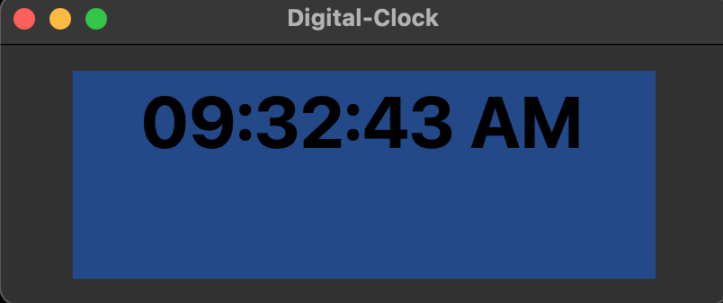

Digital Clock using Python and Tkinter

This script create a digital clock as per the system's current time.
Library Used

tkinter
time

To install required external modules

    Run pip install tkinter
    or  pip3 install tkinter

# Sample image below:

